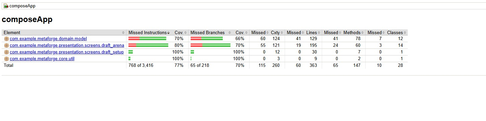

# MetaForge: MLBB Strategic Drafting Advisor

## 1. Deskripsi Proyek
**MetaForge** adalah aplikasi *mobile multiplatform* (Android & iOS) yang membantu pemain Mobile Legends: Bang Bang (MLBB) dalam fase *draft pick*. MetaForge menggunakan **Sistem Skoring Algoritmik (Rule-Based System)** berbasis data meta terkini untuk menghitung prioritas *pick*, poin sinergi, dan persentase *counter* lawan memberikan rekomendasi *drafting*.

## 2. Tim Pengembang
| Nama | NIM | GitHub |
|------|-----|--------|
| Anselmus Herpin Hasugian | 123140020 | @forkaton |
| Adi Septriansyah | 123140021 | @Protoflicker |

## 3. Tech Stack
| Kategori | Library/Tool |
|----------|-------------|
| Framework | Kotlin Multiplatform (KMP) + Compose Multiplatform |
| Architecture | Clean Architecture + MVVM |
| Networking | Ktor Client (OkHttp/Darwin) + Kotlinx Serialization |
| Local Storage | SQLDelight (hero DB) + DataStore (preferences & JSON cache) |
| DI | Koin |
| State | StateFlow + Sealed UI State classes |
| Image Loading | Coil 3 (with Ktor network fetcher) |
| CI/CD | GitHub Actions |

## 4. API & Endpoints

### 4.1 MLBB Hero Positions API
> **Source:** https://mlbb.rone.dev/  
> **Auth:** None (public API)

| Method | Endpoint | Description |
|--------|----------|-------------|
| `GET` | `https://mlbb.rone.dev/api/heroes/positions?size=150` | Fetches all hero positions with lane data, used to populate the local SQLDelight hero database on every launch |

**Response shape (simplified):**
```json
{
  "data": {
    "records": [{
      "data": {
        "hero_id": 1,
        "hero": { "data": { "name": "Miya", "smallmap": "<image_url>", "roadsort": [{"data": {"road_sort_title": "Gold Lane"}}] } }
      }
    }]
  }
}
```

### 4.2 Hero Meta JSON (GitHub)
> **Source:** https://github.com/p3hndrx/MLBB-API  
> **Auth:** None (public repository)

| Method | Endpoint | Description |
|--------|----------|-------------|
| `GET` | `https://raw.githubusercontent.com/p3hndrx/MLBB-API/main/v1/hero-meta-final.json` | Fetches full hero meta data including tiers, counters, synergies, and lane assignments. Fetched on every app launch; cached in DataStore for offline use |

**Response shape (simplified):**
```json
{
  "data": [{
    "hero_name": "Fanny",
    "mlid": "17",
    "portrait": "<portrait_url>",
    "laning": ["Jungle"],
    "class": "Assassin",
    "speciality": ["Mobility", "Damage"],
    "counters": [{ "heroid": 12, "heroname": "Chou" }],
    "synergies": [{ "heroid": 3, "heroname": "Tigreal" }]
  }]
}
```

---

## 5. Fitur Utama

### Sprint 4: Polish & Testing
* **Target Tier  Ban Count Dinamis:** Epic (3 ban/tim), Legend (4 ban/tim), Mythic (5 ban/tim). UI ban-row otomatis menyesuaikan jumlah slot yang aktif.
* **Party Size Multi-Select:** Solo / Duo / Trio / Squad. User pilih `N` *Slot* + `N` *Preferred Lane* lewat **radio button** (kapasitas dibatasi sesuai party size). Squad menyembunyikan pilihan slot/lane rekomendasi otomatis semua 5 slot ally.
* **Smart Suggestion v2:**
  - *Solo/Duo/Trio:* satu grup rekomendasi per lane preferensi. Begitu ally mengisi lane itu, grup-nya **hilang** dari panel (drop covered lane).
  - *Squad:* meta-first per active ally slot, **exclude lane** yang sudah ditutup ally maupun lane yang baru saja di-claim slot lain.
  - *Ban suggestion:* lane-agnostic (selalu top-tier meta  bans adalah keputusan tim, bukan per role).
* **Mid-draft Reconfiguration:** Pick order & preferred lane bisa diganti di tengah draft (chip `Lane: …` / `Pick: …` di config row) via `MultiSelectDialog`.
* **UI Polish:**
  - `AnimatedVisibility` (fade + expand/shrink) untuk panel suggestion.
  - `Crossfade` antar phase Loading / Error / Ready di Draft Arena.
  - `animateColorAsState` pada phase banner & active-slot border.
  - Material 3 spacing scale (`DraftDimens.Screen/Section/Slot/Inner`).
  - Retry-able error state dengan tombol `Retry` dan ikon ErrorOutline.
* **Unit Tests (25 tes JVM, 0 failures):**
  - State: Loading, Ready (meta-ranked bans), Error.
  - Snake-pick wave (1-2-2-2-2-1) untuk first-pick & second-pick user.
  - Counter & synergy scoring.
  - Lane update mid-draft.
  - Epic-tier 3-ban completion.
  - Squad meta-first + lane exclusion per active slot.
  - Duo drop-group ketika lane sudah ter-cover ally.
* **UI / Instrumented Tests (`DraftSetupScreenTest`, `DraftSetupTierTest`, `DraftSetupPartySizeTest`  8 tes Compose UI):**
  - Semua tier chips (Epic/Legend/Mythic) dan party size chips terlihat pada load pertama.
  - Label ban count berubah sesuai tier (`3/4/5 BANS / TEAM`).
  - START dinonaktifkan sampai user memilih N slot + N lane sesuai party size.
  - Squad menyembunyikan section 4 & 5 (pick order & preferred lane).
  - Duo memerlukan tepat 2 slot + 2 lane sebelum START aktif.
  - Blue (1st) / Red (2nd) selalu tampil di semua party size.

> **Coverage report:**
>
> 
>
> *Generate ulang lokal: `./gradlew :composeApp:jacocoTestReport`  `composeApp/build/reports/jacoco/jacocoTestReport/html/index.html`*

### Sprint 3: Advanced Features
* **Remote Hero Meta Fetch:** Data hero di-fetch dari GitHub Raw API (`hero-meta-final.json`) setiap kali aplikasi dibuka. Data di-cache di DataStore sehingga tetap tersedia saat offline.
* **Dual API Integration:** Hero list (posisi & lane) dari `mlbb.rone.dev`, data tier/counter/sinergi dari GitHub MLBB-API.
* **Offline Support (Network-First + Cache Fallback):** Banner offline muncul otomatis saat koneksi terputus dan dapat di-dismiss. Hero meta tetap tersedia dari cache DataStore.
* **Hero Tier List & Encyclopedia:** 100+ hero dikelompokkan ke Tier SS/S/A/B/C/D berdasarkan data meta. Halaman detail menampilkan statistik win rate/pick rate/ban rate per rank + tab Matchups (counters, weak against, synergies).
* **Dual Suggestions:** Ban suggestions (muncul saat fase ban, berdasarkan tier + ban rate + lane pilihan) dan Pick suggestions (muncul saat giliran pick user, berdasarkan counter/synergy/lane).
* **Settings Screen:** Toggle dark/light mode.

### Sprint 2: Core Features
* **Draft Simulator:** Simulasi fase pick & ban 5v5 dengan sistem CRUD (Create/Update/Delete) hero pada tiap slot.
* **Hero Encyclopedia:** Katalog hero dengan filter per lane.
* **Smart Scoring:** Saat giliran pick tiba, sistem menganalisis draf dan memberikan saran hero beserta warning counter.
* **Navigation:** Navigasi multi-screen dengan argument passing.

### Sprint 1: Planning & Setup
* Inisialisasi repositori KMP, setup CI/CD GitHub Actions, Koin DI, package name configuration.

---

## 6. Arsitektur Proyek
```
composeApp/src/
├── commonMain/
│   ├── data/
│   │   ├── local/          # SQLDelight DB, HeroMetaService, DataStore prefs
│   │   ├── remote/         # HeroMetaFetcher (GitHub), MLBBApiService
│   │   └── repository/     # DraftRepositoryImpl
│   ├── domain/
│   │   ├── model/          # Hero, DraftState, HeroMetaEntry, HeroTier, HeroLane
│   │   ├── repository/     # DraftRepository interface
│   │   └── usecase/        # NoteUseCases
│   └── presentation/
│       ├── screens/        # Home, DraftSetup, DraftArena, HeroList, HeroInfo, Settings
│       ├── navigation/     # AppNavHost, Routes, BottomNavItem
│       └── theme/          # MetaForgeTheme
├── androidMain/
│   ├── core/di/            # AndroidModule (DataStore, DB driver, ConnectivityObserver)
│   └── core/connectivity/  # AndroidConnectivityObserver
└── iosMain/
    └── core/di/            # IosModule (DB driver, stub DataStore, stub Connectivity)
```

---

## 7. Sprint Progress
| Sprint | Status | Deliverable |
|--------|--------|-------------|
| W11  Sprint 1: Planning & Setup | ✅ Done | Repo, CI/CD, DI, navigation scaffold |
| W12  Sprint 2: Core Features | ✅ Done | Draft sim, hero list, CRUD, local data |
| W13  Sprint 3: Advanced Features | ✅ Done | API, offline cache, tier list, dark mode, dual suggestions |
| W14  Sprint 4: Polish & Testing | ✅ Done | Tierban count, party multi-select, squad meta-first, lane-agnostic bans, live data label, 25 unit tests + 8 UI tests, 77% coverage |
| W15  Sprint 5: Final Preparation | ⏳ | Release APK, final docs, demo prep |
| W16  UAS: Final Demo Day | ⏳ | Presentation |

---

## 8. Setup & Build

### Prerequisites
* Android Studio Hedgehog or later
* JDK 17
* Android SDK API 35

### Run
```bash
./gradlew :composeApp:installDebug
```

### Unit Tests (JVM  no device needed)
```bash
./gradlew :composeApp:testDebugUnitTest
# Expected: 25 tests, 0 failures (DraftViewModelTest × 9, DraftRepositoryTest × 14,
#           DraftSetupViewModelTest × 11, LastFetchFormatterTest × 3 = 37 total)
```

### UI Tests / Instrumented Tests (requires connected Android device or emulator)
```bash
./gradlew :composeApp:connectedDebugAndroidTest
```
*Tests cover: DraftSetupScreen tier chips, ban-count label, START gate, Squad mode, party size flow.*

### Coverage Report
```bash
./gradlew :composeApp:jacocoTestReport
# Open: composeApp/build/reports/jacoco/jacocoTestReport/html/index.html
# Result: 77% instructions / 70% branches (business logic scope)
```

---

## 9. Video Demo Sprint 2

https://github.com/user-attachments/assets/9f3c1265-c264-40a0-b0ac-dc754f712ab0

## 10. Video Demo Sprint 3

https://github.com/user-attachments/assets/bdf4f982-e067-4f27-87bb-1fedf4255839

## 11. Video Demo Sprint 4

https://github.com/user-attachments/assets/b6b57d58-611c-4bd5-b2cd-db5b958d253a
